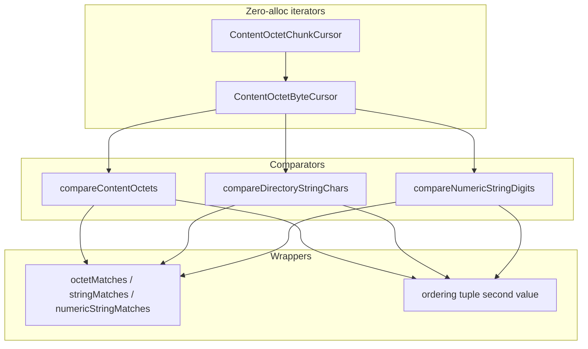

# Zero-Allocation Encoded String Comparison

## Problem

[`BERElement.deconstruct()`](source/codecs/ber.mts) recursively walks constructed string/OCTET STRING fragments and joins them with `Buffer.concat` (see lines 920–949). That forces at least one allocation (often many) before byte comparison. Constructed encodings are common in BER; CER also fragments large strings into 1000-byte OCTET STRING children via [`unfragmentedValue`](source/codecs/cer.mts).

DER strings are **primitive-only** by design ([`DERElement.deconstruct`](source/codecs/der.mts) is a clone stub), so byte-for-byte `value` comparison already works — but CER shares BER’s fragmentation problem.

## Architecture



**Critical constraint:** never call `element.value` on a **constructed** element — the [`value` getter](source/codecs/ber.mts) serializes children via `encodeSequence()` and replaces `_value` with a flat buffer (allocation + mutation). Iterators must branch on `construction` and use `sequenceElements(false)` only when `_value` is still a byte buffer.

## File layout (new utils, no codec duplication)

Add under [`source/utils/compareEncoded/`](source/utils/compareEncoded/):

| File | Role |
|------|------|
| `ContentOctetChunkCursor.mts` | Stack-based chunk iterator (no generators) |
| `ContentOctetByteCursor.mts` | Byte cursor over one chunk iterator |
| `compareContentOctets.mts` | Raw octet comparison + ordering |
| `compareDirectoryStringChars.mts` | X.520-ish PrintableString normalization |
| `compareNumericStringDigits.mts` | NumericString digit comparison |
| `matches.mts` | `octetMatches`, `stringMatches`, `numericStringMatches` |
| `index.mts` | Barrel |

Export from [`source/utils/index.mts`](source/utils/index.mts) and [`source/index.mts`](source/index.mts).

**Do not** add parallel methods on `BERElement` / `CERElement` / `DERElement` — one ASN1Element-based implementation avoids duplication. Type signatures can name `ASN1Element` (or `BERElement` in docs) since behavior is codec-agnostic.

## Documentation (JSDoc)

Every new exported class, type, and function gets full JSDoc matching existing utils style (see [`compareSetOfElementsCanonically.mts`](source/utils/compareSetOfElementsCanonically.mts) and [`asn1ValueNotation.mts`](source/utils/asn1ValueNotation.mts)):

- `@summary` — one-line purpose
- `@description` — behavior, semantics of return values (`-1`, `-2`, prefix cases), and known limitations (ASCII-only directory strings, no UTF-8)
- `@param` / `@returns` / `@typedef` as appropriate
- `@function` or `@class` tag
- **`@author Cursor Composer`** on every new export so AI-authored code is identifiable in the future

Internal helpers (e.g. normalization byte mapper) may omit `@author` if not exported, but all public API surface must have it.

## Iterator design

### `ContentOctetChunkCursor`

Stateful class (reusable, zero per-iteration allocation):

```typescript
// Conceptual shape
class ContentOctetChunkCursor {
  constructor(el: ASN1Element, fragmentTagNumber = ASN1UniversalType.octetString);
  nextChunk(): Uint8Array | undefined; // undefined = exhausted
}
```

Algorithm (mirrors `deconstruct` validation, without joining):

- **Primitive:** yield `el.value` once (aliases existing buffer; no clone).
- **Constructed:** obtain children via `Array.isArray(_value) ? _value : el.sequenceElements(false)` — same pattern as [`sequenceElements`](source/codecs/ber.mts).
- For each child: validate universal tag + `fragmentTagNumber` (default 4 = OCTET STRING); throw same `ASN1ConstructionError` messages as `deconstruct` for invalid fragments.
- **Nested constructed:** push child onto an internal stack; pop when child’s chunks exhausted.
- **Recursion depth:** track depth locally (mirror `recursionCount` / `nestingRecursionLimit = 5`) — do not mutate `el.recursionCount` during comparison (side-effect-free).
- **BIT STRING:** out of scope for this task (strings only). Cursor accepts `fragmentTagNumber` for future reuse but initial comparators use OCTET STRING fragments only.

### `ContentOctetByteCursor`

Wraps one `ContentOctetChunkCursor`:

- Holds current chunk + index within chunk.
- `nextByte(): number | undefined` advances across chunk boundaries.
- Optional `peekByte()` for normalization lookahead without consuming (directory-string whitespace collapse).

## Comparison API

### Shared result type

```typescript
export type EncodedCompareResult = readonly [index: number, ordering: -1 | 0 | 1];
```

Semantics (unified across all three comparators):

| `index` | Meaning |
|---------|---------|
| `-1` | Fully equal under this rule |
| `-2` | Invalid input (NumericString only: non-digit/non-space byte) |
| `>= 0` | First mismatch position **or** matched count when one side ends before the other (prefix semantics) |

`ordering` is `-1` / `0` / `1` for `Array.sort` per X.520 ordering rules at the first difference (0 when equal).

### Dispatch: element vs `Uint8Array` without JIT pain

Provide **two entry points** that share the inner loop (no `instanceof` in the hot loop):

- `compareContentOctetsToElement(a, b, options)`
- `compareContentOctetsToBytes(a, bytes, options)`

Public overload wrapper dispatches once at the top:

```typescript
export function compareContentOctets(a: ASN1Element, b: ASN1Element | Uint8Array, opts?): EncodedCompareResult {
  return b instanceof Uint8Array
    ? compareContentOctetsToBytes(a, b, opts)
  : compareContentOctetsToElement(a, b, opts);
}
```

Same pattern for directory-string and numeric comparators. `Uint8Array` side is always treated as a **single primitive chunk** (flat reference bytes / prefix).

### `compareContentOctets` (octetStringOrderingMatch / caseExact / caseIgnore)

Options: `{ asciiCaseFold?: boolean }`

- Walk both byte cursors in parallel.
- If `asciiCaseFold`: map `A–Z` → `a–z` inline (`b | 0x20` when `b >= 0x41 && b <= 0x5A`).
- On mismatch: return `[i, sign]` where `sign = cmp(aByte, bByte)` and `i` is 0-based content-octet index.
- If one side ends first: return `[shorterLength, sign]` with `sign` from implicit end-of-string vs next byte (shorter < longer → `-1`).
- Equal: `[-1, 0]`.

### `compareDirectoryStringChars` (caseIgnoreOrderingMatch / caseExactOrderingMatch)

Options: `{ asciiCaseFold?: boolean }` (default `true` for directory matching).

**Scope:** single-byte ASCII only (PrintableString / IA5String path). No UTF-8 multi-byte support in v1 — avoids abstruse UTF-8 state machine; document limitation.

Per-byte normalization before comparison (X.520 excerpt, ASCII subset):

| Input byte | Mapped |
|------------|--------|
| `0x09, 0x0A, 0x0B, 0x0C, 0x0D` (TAB/LF/VT/FF/CR) | `0x20` (SPACE) |
| Other controls (`< 0x20`, `0x7F`) | skip (mapped to nothing) |
| `0x20` | whitespace |
| Other printable bytes | themselves |

Comparison loop (two-sided pull with lookahead):

1. Skip leading whitespace on both sides.
2. For each logical character: collapse internal whitespace runs to **one** SPACE on each side independently.
3. Skip trailing whitespace before declaring equality.
4. `asciiCaseFold`: same ASCII upper→lower as octet compare.
5. **Index semantics:** count of logical characters matched (non-whitespace chars + one per internal whitespace span). On mismatch return that count; on equal return `[-1, 0]`.

Ordering at mismatch: compare normalized logical characters (after case fold).

### `compareNumericStringDigits` (numericStringOrderingMatch)

- Skip `0x20` bytes entirely on both sides.
- Only compare `0x30–0x39`.
- Any other byte → `[-2, 0]` immediately.
- **Index semantics:** count of matched digits (not byte index).
- Ordering: at first differing digit, `sign = aDigit - bDigit` (sufficient for digit-only strings; matches common X.520 numeric ordering for equal-length digit sequences). Document that leading-zero / unequal-length numeric ordering nuances are acceptable for v1.

### Equality wrappers ([`matches.mts`](source/utils/compareEncoded/matches.mts))

```typescript
octetMatches(a, b, asciiCaseFold?) => compareContentOctets(...)[0] === -1
stringMatches(a, b, asciiCaseFold?) => compareDirectoryStringChars(...)[0] === -1
numericStringMatches(a, b) => compareNumericStringDigits(...)[0] === -1
```

## CER / DER strategy (single implementation)

| Codec | Constructed strings? | Approach |
|-------|---------------------|----------|
| BER | Yes | Full chunk cursor |
| CER | Yes (1000-byte fragments) | Same cursor (identical fragment rules) |
| DER | No (getters throw) | **Fast path:** if both operands primitive, compare `a.value` vs `b.value` directly (or vs `Uint8Array`) without cursor setup; fall back to cursor only if constructed children exist (foreign/malformed data) |

No separate DER/CER copies — one cursor + comparators on `ASN1Element`.

## Unit tests

New file: [`test/utils/compareEncoded.test.mjs`](test/utils/compareEncoded.test.mjs) using `node:test` + `node:assert/strict` (same pattern as [`test/ber/constructed.test.mjs`](test/ber/constructed.test.mjs)). Run via `npm run build && npm test`.

Tests are a **required deliverable**, not an afterthought. Organize with `describe` blocks per module:

### `ContentOctetChunkCursor` / `ContentOctetByteCursor`

- Primitive element yields exactly one chunk equal to content octets.
- Constructed element with 2–3 OCTET STRING fragments yields chunks in order without allocating a joined buffer.
- Nested constructed (2+ levels) yields correct byte sequence across chunk boundaries.
- `nextByte()` walks all bytes across multiple chunks.
- Invalid fragment tag throws `ASN1ConstructionError` (parity with `deconstruct`).

### `compareContentOctets`

- Equal primitive vs primitive → `[-1, 0]`.
- First-byte mismatch → correct index and ordering sign.
- Prefix: shorter element matches longer prefix → matched count (not `-1`).
- `asciiCaseFold` true: `A` vs `a` equal; false: differ.
- Element vs `Uint8Array` operand (prefix and full match).
- Constructed BER vs primitive with same logical content → equal.

### `compareDirectoryStringChars`

- Leading/trailing whitespace ignored.
- Internal whitespace runs collapse to one logical space.
- TAB/CR/LF mapped to space before collapse.
- Control bytes (`0x01`, `0x7F`) skipped.
- Case fold on/off.
- Constructed encoding with whitespace split across fragments.

### `compareNumericStringDigits`

- Spaces ignored; digits compared.
- Invalid byte → `[-2, 0]`.
- Digit mismatch returns matched-digit count and ordering sign.

### `matches` wrappers

- `octetMatches` / `stringMatches` / `numericStringMatches` return `true` iff corresponding compare returns `-1`.

### Cross-codec / ordering

- CER fragmented long string equals primitive encoding of same content.
- DER primitive fast path.
- `Array.sort` smoke test using ordering tuple second element.

## Benchmarks

New file: [`benchmark/compare-encoded.mjs`](benchmark/compare-encoded.mjs) using existing `performance.now()` warmup pattern from [`benchmark/from-bytes.mjs`](benchmark/from-bytes.mjs).

Scenarios:

| Case | Size | Encoding |
|------|------|----------|
| primitive | 64 / 4K | single buffer |
| constructed | 4K / 64K | 4–64 OCTET STRING fragments |
| nested | medium | 2-level nesting |

Compare per scenario:

1. **New:** `compareContentOctets` / `stringMatches` / `numericStringMatches`
2. **Baseline:** `Buffer.compare(a.deconstruct(...), b.deconstruct(...))` (or concat + loop for directory/numeric normalization on flat bytes)

Report ns/op for equal, first-byte-diff, and prefix cases.

Optional: fix broken `npm run benchmark` script (points to missing `test/benchmark.mjs`) to run `node benchmark/compare-encoded.mjs` — only if you want it; not required for the feature.

## Release

After implementation, tests, and benchmarks pass:

1. Bump **minor** version `11.3.0` → **`11.4.0`** in both [`package.json`](package.json) and [`jsr.json`](jsr.json).
2. Add a `[11.4.0]` section at the top of [`CHANGELOG.md`](CHANGELOG.md) documenting:
   - New zero-allocation encoded content comparison utilities (`compareContentOctets`, `compareDirectoryStringChars`, `compareNumericStringDigits`, `octetMatches`, `stringMatches`, `numericStringMatches`, chunk/byte cursors).
   - Constructed BER/CER string support without `deconstruct()`.
   - `Uint8Array` operand overload for prefix matching.

## Implementation order

1. `ContentOctetChunkCursor` + `ContentOctetByteCursor` + JSDoc.
2. Unit tests for iterators.
3. `compareContentOctets` (+ element/bytes split) + JSDoc + tests.
4. `compareDirectoryStringChars` + JSDoc + tests.
5. `compareNumericStringDigits` + JSDoc + tests.
6. `matches.mts` wrappers + JSDoc + tests.
7. Exports from `utils/index.mts` and `source/index.mts`.
8. Benchmark script.
9. Version bump (`11.4.0`) + CHANGELOG entry.

## Non-goals (v1)

- BIT STRING fragment comparison (separate unused-bits handling).
- Full UTF-8 DirectoryString / BMPString / UniversalString X.520 normalization.
- Changing existing `deconstruct()` behavior.
